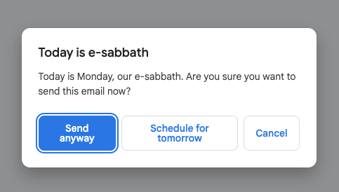

# Sabbath Reminder

A Chrome extension that reminds **acts2.network** Gmail users that **Monday is
e-sabbath** before they send an email.

## What it does

When you click **Send** (or press <kbd>Ctrl</kbd>/<kbd>Cmd</kbd>+<kbd>Enter</kbd>)
in Gmail, the extension checks two things:

1. Is today **Monday** (the e-sabbath)?
2. Is the active Gmail account on the **`acts2.network`** domain?

If both are true, sending is paused and a dialog appears:



You can choose:

- **Send anyway** — sends the email immediately.
- **Schedule for tomorrow** — uses Gmail's built-in *Schedule send* to send the
  email tomorrow at 8:00 AM (local time).
- **Cancel** — does nothing; the email stays in the compose window.

On any other day, or for accounts outside `acts2.network`, the extension stays
completely out of the way.

## Install (load unpacked)

1. Open `chrome://extensions` in Chrome.
2. Turn on **Developer mode** (top-right).
3. Click **Load unpacked** and select this repository's folder.
4. Open [Gmail](https://mail.google.com) and try sending an email on a Monday
   from an `acts2.network` account.

## Configuration

The defaults live at the top of [`src/content.js`](src/content.js):

| Constant          | Default          | Meaning                                    |
| ----------------- | ---------------- | ------------------------------------------ |
| `SABBATH_DOMAIN`  | `acts2.network`  | Only accounts on this domain are reminded. |
| `SABBATH_DAY`     | `1` (Monday)     | Day of week for the e-sabbath (0 = Sun).   |
| `SCHEDULE_HOUR`   | `8`              | Hour to schedule "tomorrow" sends.         |
| `SCHEDULE_MINUTE` | `0`              | Minute to schedule "tomorrow" sends.       |

## Files

```
manifest.json      # MV3 manifest
src/content.js     # interception + modal + scheduling logic
src/modal.css      # modal & toast styling
icons/             # extension icons
```

## Notes & limitations

- The "Schedule for tomorrow" option drives Gmail's native *Schedule send*
  dialog through the DOM. Gmail's markup changes frequently; if auto-scheduling
  fails, the extension leaves the scheduling dialog open and shows a toast so
  you can pick a time manually.
- The active account is detected from the page title / account switcher. If you
  use multiple accounts in one window, make sure the correct account is active.
