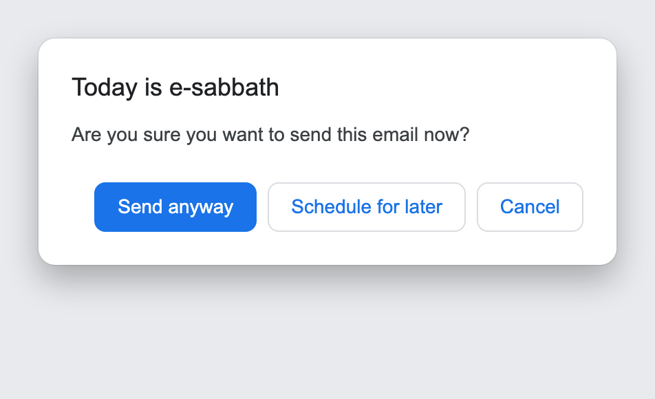

# Sabbath Reminder

A Chrome extension that reminds you that **Monday is e-sabbath** before you send
an email in Gmail.

## What it does

When you click **Send** (or press <kbd>Ctrl</kbd>/<kbd>Cmd</kbd>+<kbd>Enter</kbd>)
in Gmail on a **Monday** (the e-sabbath), sending is paused and a dialog appears:



You can choose:

- **Send anyway** — sends the email immediately.
- **Schedule send** — opens Gmail's built-in *Schedule send* date & time picker
  so you can choose when to send.
- **Cancel** — does nothing; the email stays in the compose window.

On any other day the extension stays completely out of the way. It applies to
every account in the browser, so install it only where the reminder is wanted.

## Install (load unpacked)

Chrome has no build step for this extension — it loads the source directly.

1. **Get the code.** Clone the repo (or download the ZIP from GitHub and
   unzip it):

   ```bash
   git clone git@github.com:Acts2Network/sabbath-reminder.git
   ```

2. Open `chrome://extensions` in Chrome.
3. Turn on **Developer mode** (toggle, top-right).
4. Click **Load unpacked** and select the `sabbath-reminder` folder (the one
   containing `manifest.json`).
5. Open [Gmail](https://mail.google.com). If you're not already on it, reload
   the tab so the extension loads.

The reminder appears whenever you send mail on a **Monday**.

### Updating

After pulling new changes (`git pull`), go to `chrome://extensions`, click the
**reload** ↻ icon on the Sabbath Reminder card, then reload your Gmail tab.

### Notes

- Keep the unpacked folder where it is — Chrome loads the extension from that
  path on every launch. Deleting or moving it removes the extension.
- "Developer mode" extensions are normal for internal tools. For org-wide
  rollout without manual steps, see the Chrome Web Store (unlisted) or Google
  Workspace admin force-install options.

## Configuration

The defaults live at the top of [`src/content.js`](src/content.js):

| Constant      | Default      | Meaning                                  |
| ------------- | ------------ | ---------------------------------------- |
| `SABBATH_DAY` | `1` (Monday) | Day of week for the e-sabbath (0 = Sun). |

## Files

```
manifest.json      # MV3 manifest
src/content.js     # interception + modal + scheduling logic
src/modal.css      # modal & toast styling
icons/             # extension icons
```

## Publishing (Chrome Web Store)

Releases are automated by [`.github/workflows/publish.yml`](.github/workflows/publish.yml).
Pushing a version tag builds the zip and publishes via the Chrome Web Store API:

```bash
# bump "version" in manifest.json first, then:
git tag v1.1.0 && git push origin v1.1.0
```

One-time setup — add these **repository secrets** (Settings → Secrets and
variables → Actions):

| Secret              | Where to get it                                            |
| ------------------- | ---------------------------------------------------------- |
| `CWS_EXTENSION_ID`  | Extension ID from the Web Store dashboard URL.             |
| `CWS_CLIENT_ID`     | OAuth client ID (Desktop app) from Google Cloud Console.   |
| `CWS_CLIENT_SECRET` | OAuth client secret.                                       |
| `CWS_REFRESH_TOKEN` | Refresh token for scope `chromewebstore` (generated once). |

Enable the **Chrome Web Store API** in the Cloud project first. The workflow can
also be run manually from the **Actions** tab (`workflow_dispatch`).

## Notes & limitations

- The **Schedule send** option opens Gmail's native *Schedule send* dialog and
  surfaces its date & time picker through the DOM; you choose the time there.
  Gmail's markup changes frequently — if the picker can't be opened, use the
  Send button's own dropdown ▸ *Schedule send*.
- The reminder fires for **every** Gmail account in the browser. Install it only
  where the e-sabbath reminder is wanted.
